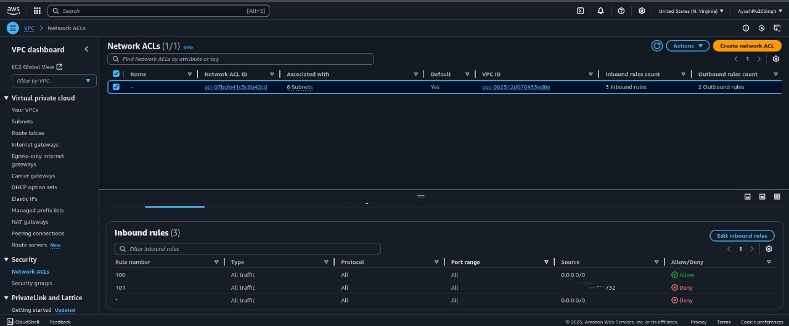

Cloud-Native SIEM with Automated SOAR Response on AWS
This project demonstrates the end-to-end creation of a functional Security Information and Event Management (SIEM) system within the AWS cloud, complete with an automated response playbook (SOAR) to block threats in real-time.

The entire infrastructure is deployed using Terraform, with Wazuh serving as the open-source SIEM platform. The automated response is handled by a custom Python script that interacts with AWS services.

---

## Project Architecture & Workflow

1.  **Infrastructure Deployment**: Terraform scripts are used to create the necessary cloud resources (EC2 instances, Security Groups, IAM Roles) in a repeatable and automated fashion.
2.  **SIEM & Agent Setup**: A Wazuh server is installed on a dedicated EC2 instance. A Wazuh agent is installed on a "victim" server to forward logs and security events to the SIEM.
3.  **Detection Engineering**: A custom rule is written on the Wazuh server to detect a specific attack pattern—in this case, an SSH brute-force attack—by correlating multiple failed login attempts.
4.  **Automated Response (SOAR)**: When the custom rule is triggered, the Wazuh manager executes a Python script.
5.  **Threat Mitigation**: The Python script uses AWS APIs to automatically add a `DENY` rule to the AWS Network ACL, blocking all traffic from the attacker's IP address.

---

## Project Showcase: Screenshots

### 1. Successful Detection: Brute-Force Alert
This screenshot shows the custom Level 12 alert (ID 100100) successfully firing in the Wazuh dashboard after the simulated attack.


### 2. Automated Response: Firewall Block
This screenshot shows the AWS VPC Network ACL with the new `DENY` rule that was automatically added by the Python script, blocking the attacker's IP.



---

## Detailed Steps & Commands

Below are the phases and commands used to build this project from scratch on a Kali Linux machine.

### Phase 1: Infrastructure as Code (IaC) with Terraform

* **Need**: To create our cloud environment in an automated, repeatable way.
* **Commands (run on Kali Linux)**:
    ```bash
    # Install AWS CLI and Terraform
    sudo apt update
    sudo apt install awscli python3-pip -y
    # (Terraform installation steps...)

    # Configure AWS credentials
    aws configure

    # Create Terraform project files (main.tf, .gitignore)

    # Generate SSH key for instance access
    ssh-keygen -t ed25519

    # Deploy infrastructure
    terraform init
    terraform plan
    terraform apply
    ```

### Phase 2: SIEM Deployment & Agent Configuration

* **Need**: To install the Wazuh SIEM server and connect a monitored agent.
* **Commands (run on SIEM Server via SSH)**:
    ```bash
    # Create a swap file to provide enough memory for installation
    sudo fallocate -l 4G /swapfile
    sudo chmod 600 /swapfile
    sudo mkswap /swapfile
    sudo swapon /swapfile
    echo '/swapfile none swap sw 0 0' | sudo tee -a /etc/fstab

    # Download and run the Wazuh all-in-one installer
    curl -sO https://packages.wazuh.com/4.7/wazuh-install.sh
    sudo bash ./wazuh-install.sh -a -i
    ```
* **Commands (run on Victim Server via SSH)**:
    ```bash
    # Run the agent deployment command copied from the Wazuh dashboard
    sudo WAZUH_MANAGER='...' bash ...

    # Start the agent
    sudo systemctl start wazuh-agent
    ```

### Phase 3: Detection Engineering

* **Need**: To create a custom rule that correlates multiple low-level events into a single high-priority, actionable alert.
* **Commands (run on SIEM Server via SSH)**:
    ```bash
    # Edit the local rules file
    sudo nano /var/ossec/etc/rules/local_rules.xml

    # Restart the manager to apply the new rule
    sudo systemctl restart wazuh-manager
    ```
* **Commands (run on Kali Linux to test)**:
    ```bash
    # Simulate a brute-force attack
    hydra -l fakeuser -p fakepass ssh://[VICTIM_SERVER_IP]
    ```

### Phase 4: Automated Response (SOAR)

* **Need**: To automatically block the attacker without human intervention when the alert is triggered.
* **Commands (run on SIEM Server via SSH)**:
    ```bash
    # Install AWS SDK for Python
    sudo pip3 install boto3

    # Create the Python response script
    sudo nano /var/ossec/active-response/bin/block-ip.py

    # Set correct ownership and permissions
    sudo chmod 750 /var/ossec/active-response/bin/block-ip.py
    sudo chown root:wazuh /var/ossec/active-response/bin/block-ip.py

    # Edit the main Wazuh config to enable and trigger the script
    sudo nano /var/ossec/etc/ossec.conf

    # Restart the manager to apply all changes
    sudo systemctl restart wazuh-manager
    ```

### Final Step: Cleanup

* **Need**: To destroy all cloud resources to avoid incurring costs.
* **Command (run on Kali Linux)**:
    ```bash
    terraform destroy
    ```
